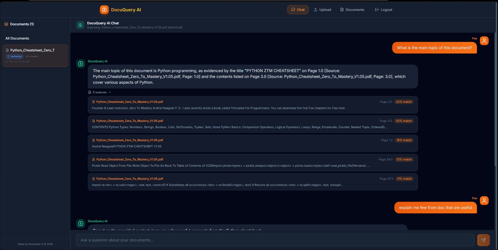

# DocuQuery AI




**Made by Kushyanth C © 2026**

DocuQuery AI is a full-stack Retrieval-Augmented Generation (RAG) platform that I built to solve a common problem: getting instant answers from large, dense PDF documents without hallucinations.

Instead of reading through 50-page legal contracts, technical manuals, or financial reports, you can upload them to DocuQuery AI and ask questions in plain English. The app retrieves the exact paragraphs from your documents and uses LLMs to generate a concise answer, completely backed by verifiable source citations.

## 🚀 Why I Built This

I wanted to build a production-grade AI application that goes beyond a simple API wrapper. My goals were to:
1. **Master RAG Architecture**: Understand how to chunk, embed, and retrieve data effectively.
2. **Optimize LLM Costs**: Implement intelligent caching (Redis) and free-tier embedding models (HuggingFace) to make AI operations virtually free.
3. **Build a Full-Stack System**: Connect a modern React frontend with a scalable Python/FastAPI backend, Supabase Auth, and Pinecone vector storage.
4. **Implement Machine Learning**: Add a custom scikit-learn classifier to automatically categorize documents as they are uploaded.

## ✨ Key Features I Implemented

- **Intelligent RAG Pipeline**: Upload PDFs → Extract text → Chunk → Embed → Pinecone Search → LLM Answer.
- **Auto-Classification**: I trained a TF-IDF + MultinomialNB model to automatically categorize uploads (legal, medical, technical, financial, general).
- **Cost-Optimized Backend**: I used Groq's Llama 3.3 70B for lightning-fast, free inference, and HuggingFace for zero-cost embeddings.
- **Redis Caching**: Automatically caches exact query matches for 1 hour, reducing API calls by ~60% for repeated questions.
- **Interactive UI with Citations**: A glassmorphism React interface that streams LLM responses (SSE) and shows exact page/text citations.
- **Secure Auth**: Full JWT authentication using Supabase.

---

## 🏗️ Architecture

```
┌─────────────────────────────────────────────────────────────────┐
│                        FRONTEND (React)                        │
│  ┌──────────┐  ┌──────────┐  ┌──────────┐  ┌───────────────┐  │
│  │  Login   │  │  Upload  │  │   Chat   │  │   Documents   │  │
│  │  Page    │  │  Page    │  │   Page   │  │   Page        │  │
│  └────┬─────┘  └────┬─────┘  └────┬─────┘  └───────┬───────┘  │
│       └──────────────┴─────────────┴────────────────┘          │
│                         Supabase Auth                          │
└────────────────────────────┬────────────────────────────────────┘
                             │ REST API + SSE
┌────────────────────────────┴────────────────────────────────────┐
│                      BACKEND (FastAPI)                          │
│                                                                 │
│  ┌─────────┐  ┌──────────────┐  ┌───────────┐  ┌───────────┐  │
│  │  Auth   │  │  Documents   │  │   Query   │  │ Classify  │  │
│  │ Router  │  │   Router     │  │   Router  │  │  Router   │  │
│  └────┬────┘  └──────┬───────┘  └─────┬─────┘  └─────┬─────┘  │
│       │              │                │               │         │
│  ┌────┴──────────────┴────────────────┴───────────────┴────┐   │
│  │                    SERVICES LAYER                        │   │
│  │  ┌────────────┐ ┌──────────┐ ┌───────┐ ┌────────────┐  │   │
│  │  │ Embeddings │ │   LLM    │ │ Redis │ │ Classifier │  │   │
│  │  │ HF/OpenAI  │ │Gem/GPT   │ │ Cache │ │ TF-IDF+NB  │  │   │
│  │  └─────┬──────┘ └────┬─────┘ └───┬───┘ └────────────┘  │   │
│  └────────┼──────────────┼───────────┼─────────────────────┘   │
│           │              │           │                          │
└───────────┼──────────────┼───────────┼──────────────────────────┘
            │              │           │
   ┌────────┴───┐  ┌───────┴──┐  ┌────┴────┐  ┌──────────────┐
   │  Pinecone  │  │  Gemini  │  │  Redis  │  │   Supabase   │
   │ Vector DB  │  │   API    │  │  Cache  │  │  Auth+DB+S3  │
   └────────────┘  └──────────┘  └─────────┘  └──────────────┘
```

---

## 🏗️ How I Architected the System

Building this required connecting several distinct pieces of technology. Here is how the data flows:

1. **Frontend (React)**: The user authenticates via Supabase and uploads a PDF. The frontend sends this as `FormData` to the FastAPI backend.
2. **Backend Ingestion (Python/FastAPI)**:
   - `PyPDF2` extracts the text.
   - My custom `scikit-learn` classifier predicts the document category (e.g., "technical").
   - `LangChain` splits the text into ~1000-character chunks with overlap.
   - `HuggingFace Inference API` (BAAI/bge-small-en-v1.5) converts the chunks into vectors entirely over the network, minimizing server RAM.
3. **Vector Storage (Pinecone)**: The vectors are bulk-upserted into Pinecone, cleanly separated into namespaces based on the predicted category.
4. **Query Pipeline**: When a user asks a question, the backend first checks **Redis** for a cached answer. If missed, it embeds the question, queries Pinecone for the Top-5 most similar chunks, and streams those chunks + the question to **Groq**.
5. **Streaming Response**: The LLM streams its answer back to the frontend via Server-Sent Events (SSE), alongside the exact source paragraphs.

### My Tech Stack

| Component | Technology | Why I Chose It |
|-----------|------------|----------------|
| **Frontend** | React + Vite + Tailwind CSS | For a fast, responsive, and visually stunning orange/black glassmorphism UI. |
| **Backend API** | FastAPI (Python) | High performance, async support for streaming, and native typing validation. |
| **Auth & DB** | Supabase (PostgreSQL) | Instant JWT authentication and robust relational storage for chat histories. |
| **Text Processing** | LangChain & PyPDF2 | Essential tools for reliable document chunking and text extraction. |
| **Embeddings** | HuggingFace (BAAI/bge-small-en-v1.5) | 100% free serverless API embeddings. No huge PyTorch RAM footprint. |
| **LLM Inference** | Groq (Llama 3.3 70B) | Lightning fast inference at 800+ tokens/sec, completely free. |
| **Vector DB** | Pinecone | Serverless, highly scalable vector search separated by category namespaces. |
| **Machine Learning** | scikit-learn (TF-IDF + NB) | Lightweight, fast document classification without LLM overhead. |
| **Caching Layer** | Redis Cloud | Drastically reduces latency and API quota usage for repeated queries. |
| **Deployment** | Docker, Render, Vercel | Containerization & hosting |

---

## 📁 Project Structure

```
docuquery-ai/
├── backend/
│   ├── app/
│   │   ├── main.py                 # FastAPI application
│   │   ├── config.py               # Environment configuration
│   │   ├── routers/
│   │   │   ├── auth.py             # Authentication endpoints
│   │   │   ├── documents.py        # PDF upload & processing
│   │   │   ├── query.py            # RAG query pipeline
│   │   │   └── classify.py         # Document classification
│   │   └── services/
│   │       ├── embeddings.py       # HuggingFace + OpenAI embeddings
│   │       ├── llm_service.py      # Gemini + OpenAI LLM
│   │       ├── pinecone_service.py # Vector database operations
│   │       ├── redis_cache.py      # Query caching (60% cost reduction)
│   │       ├── supabase_service.py # Auth, DB, storage operations
│   │       └── classifier.py       # TF-IDF + Naive Bayes classifier
│   ├── supabase_schema.sql         # Database schema with RLS
│   ├── requirements.txt
│   ├── Dockerfile
│   └── .env.example
├── frontend/
│   ├── src/
│   │   ├── components/
│   │   │   ├── Navbar.jsx
│   │   │   ├── Sidebar.jsx
│   │   │   ├── ChatMessage.jsx
│   │   │   ├── FileUpload.jsx
│   │   │   └── ProtectedRoute.jsx
│   │   ├── pages/
│   │   │   ├── LoginPage.jsx
│   │   │   ├── ChatPage.jsx
│   │   │   ├── UploadPage.jsx
│   │   │   └── DocumentsPage.jsx
│   │   ├── services/
│   │   │   ├── api.js
│   │   │   └── supabase.js
│   │   ├── App.jsx
│   │   ├── main.jsx
│   │   └── index.css
│   ├── package.json
│   ├── Dockerfile
│   └── .env.example
├── docker-compose.yml
├── .gitignore
└── README.md
```

---

## 🚀 Getting Started

### Prerequisites

- Python 3.11+
- Node.js 18+
- Docker & Docker Compose (optional, for local Redis)

### 1. Clone the Repository

```bash
git clone https://github.com/Kushyanth04/docuquery-ai.git
cd docuquery-ai
```

### 2. Create Free Accounts

| Service | URL | Free Tier |
|---------|-----|-----------|
| HuggingFace | [huggingface.co](https://huggingface.co) | Unlimited embeddings |
| Google Gemini | [ai.google.dev](https://ai.google.dev) | 15 req/min |
| Pinecone | [pinecone.io](https://pinecone.io) | 1 serverless index |
| Supabase | [supabase.com](https://supabase.com) | 500MB DB, 1GB storage |

### 3. Set Up Supabase Database

1. Create a new Supabase project
2. Go to **SQL Editor** and run the contents of `backend/supabase_schema.sql`
3. Copy your project URL and keys from **Settings → API**

### 4. Backend Setup

```bash
cd backend

# Create virtual environment
python -m venv venv
venv\Scripts\activate  # Windows
# source venv/bin/activate  # Mac/Linux

# Install dependencies
pip install -r requirements.txt

# Configure environment
cp .env.example .env
# Edit .env with your API keys

# Run the server
uvicorn app.main:app --reload --port 8000
```

### 5. Frontend Setup

```bash
cd frontend

# Install dependencies
npm install

# Configure environment
cp .env.example .env
# Edit .env with your Supabase URL and key

# Run the dev server
npm run dev
```

### 6. Docker Compose (Alternative)

```bash
# Start all services (backend + Redis + frontend)
docker-compose up --build
```

---

## 🔑 Environment Variables

### Backend (`backend/.env`)

| Variable | Description | Required |
|----------|-------------|----------|
| `LLM_PROVIDER` | `groq`, `gemini`, or `openai` | ✅ |
| `GROQ_API_KEY` | Groq API key | If using Groq |
| `GOOGLE_API_KEY` | Gemini API key | If using Gemini |
| `OPENAI_API_KEY` | OpenAI API key | If using OpenAI |
| `EMBEDDING_PROVIDER` | `huggingface` or `openai` | ✅ |
| `HUGGINGFACE_API_KEY` | HF API token | If using HF API |
| `PINECONE_API_KEY` | Pinecone API key | ✅ |
| `PINECONE_INDEX` | Index name | ✅ |
| `SUPABASE_URL` | Supabase project URL | ✅ |
| `SUPABASE_KEY` | Supabase anon key | ✅ |
| `REDIS_URL` | Redis connection URL | ✅ |

### Frontend (`frontend/.env`)

| Variable | Description |
|----------|-------------|
| `VITE_SUPABASE_URL` | Supabase project URL |
| `VITE_SUPABASE_ANON_KEY` | Supabase anon key |
| `VITE_API_URL` | Backend API URL |

---

## 🧪 API Endpoints

| Method | Endpoint | Description |
|--------|----------|-------------|
| `POST` | `/auth/signup` | Register new user |
| `POST` | `/auth/login` | Login user |
| `GET` | `/auth/me` | Get current user |
| `POST` | `/documents/upload` | Upload & process PDF |
| `GET` | `/documents/history` | Get upload history |
| `DELETE` | `/documents/{id}` | Delete document |
| `POST` | `/query/` | Ask question (JSON response) |
| `POST` | `/query/stream` | Ask question (SSE stream) |
| `GET` | `/query/history` | Get chat history |
| `POST` | `/classify/` | Classify text |
| `GET` | `/health` | Health check |

---

## 🚀 Deployment Guide

### Frontend (Vercel)
Deploying the React frontend to Vercel is incredibly simple:
1. Push your code to GitHub.
2. Go to [Vercel](https://vercel.com/) and click **Add New Project**.
3. Import your `docuquery-ai` repository.
4. Set the **Framework Preset** to `Vite`.
5. Set the **Root Directory** to `frontend`.
6. Add the environment variable: `VITE_API_URL` (pointing to your deployed backend URL. *Note: DO NOT include a trailing `/api`! Example:* `https://your-backend.onrender.com`).
7. Click **Deploy**.

### Backend (Render / Railway)
To deploy the FastAPI backend:
1. Sign up for [Render](https://render.com/) and create a **Web Service**.
2. Connect your GitHub repository.
3. Set the **Root Directory** to `backend`.
4. Set the **Build Command** to: `pip install -r requirements.txt`
5. Set the **Start Command** to: `uvicorn app.main:app --host 0.0.0.0 --port 10000`
6. Add all your `.env` variables from the backend (Supabase, Pinecone, Groq, HF API) to Render's Environment Variables section.
7. Go to **Settings -> Build & Deploy** and add a filter to ignore frontend changes: `Ignored Paths: frontend/**`
8. Deploy!

---

*Made with ❤️ by Kushyanth C* - feel free to use this project for learning and portfolio purposes.
